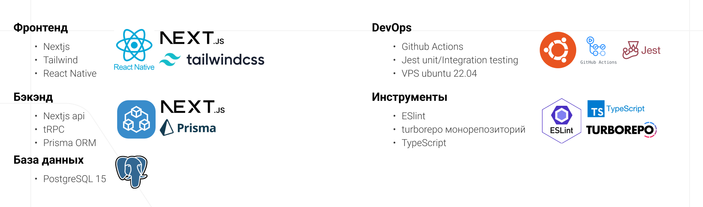
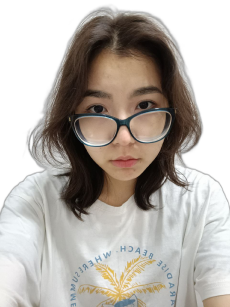
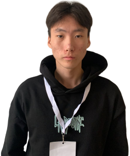

# Склад Севера
Проект создан в рамках хакатона «Hack-the-Ice 5.0. Old School» 2023.

## Суровые условия крайнего севера
В условиях Крайнего Севера и арктических районов существует проблема связанная с контролем запасов продовольствия и лекарств, управлением своими запасами и обеспечением доступности необходимых ресурсов.
1. Недостаточность поставок продовольствия и лекарств
2. Неэффективный учет и контроль запасов
3. Слабая организация управления запасами
4. Ограниченная доступность

## Разработка приложения "Склад Севера"
Наш проект “Склад Севера” решает  проблемы: недостаточности поставок продовольствия и лекарств, низкоэффективности учета и контроля запасов, слабой организации управления запасами, ограниченности доступности - у владельцев и покупателей розничных магазинов и аптек крайнего севера, с помощью цифрового решения - создания мобильного приложения, которое имеет возможности для: 
1. Аналитики и прогнозирования спроса
2. Учета и контроля запасов
3. Автоматизированного мониторинга и управления запасами
4. Оптимизации логистики и доставки;
5. Портала для информационного обмена

## Техническое задание
Must-have
1. Авторизация
2. Планирование поставок, учет продаж (контрль инвентаря)
3. Таблица продуктов, срок годности которых скоро истечет
4. Рекомендации к закупке

Желательно
1. Бронирование частными лицами продуктов
2. Запрос частными лицами закупа у магазина

В далеком будущем
1. Полная автономность приложения
2. Уведомление частных лиц о новых поступлениях в местных магазинах

## Стек технологий

## Команда «Imbir'»

|        |               |      |
| :---------------------------------------------- | :------------------------------------------------------: | --------------------------------------------: |
| Лаптева Милана                                  |                     Владимир Корякин                     |                                 Сергин Сергей |
| Менеджер                                        |                         Дизайнер                         |                                   Разработчик |
| +7 (996) 914-58-22   mlapteva162@gmail.com | +7 (999) 435-67-07   vladimirkoryakin9459@gmail.com | +7 (984) 109-30-55   etteryand@gmail.com |

